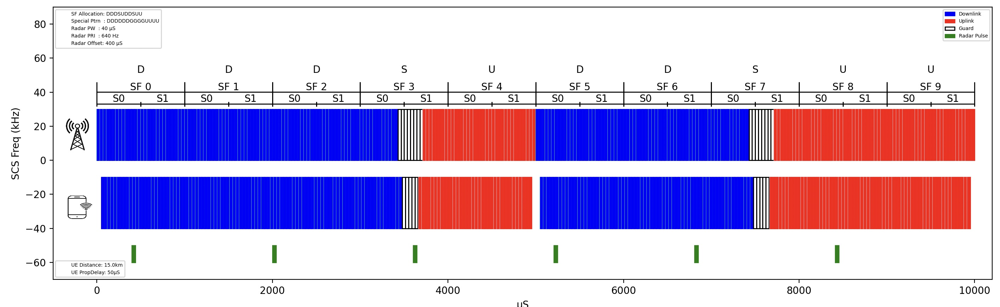

# 5GTDD-Radar-Visualizer
A Python script using Matplotlib to visualize 5G TDD slot patterns and pulsed radar interference.

E.g.
```
### Slots Structures
slotPattern = "DDDSUDDSUU"
SpecialSlotPattern = "DDDDDDDDGGGGUU"

Numerology

##Radar
RadarPW = 40 #uS
RadarPRI_Hz = 640 #Hz
```



