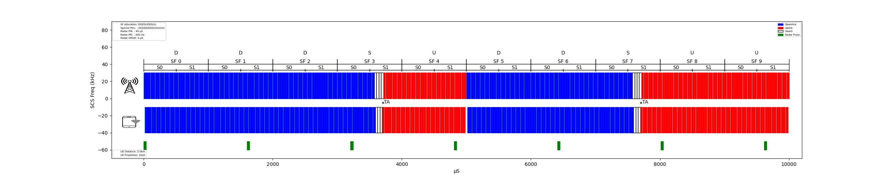

# 5GTDD-Radar-Visualizer
A Python script using Matplotlib to visualize 5G TDD slot patterns and pulsed radar interference.

E.g.
```
### Slots Structures
SubFramePattern = "DDDSUDDSUU"
SpecialSubFramePattern = "DDDDDDGGGGUUUU"

#UE
UeDistance = 15e3 # (m)
UeTimingAdvance = True

##Radar
RadarPW = 40 #uS
RadarPRI_Hz = 640 #Hz
RadarPRI_s = (1/RadarPRI_Hz )*1e6
RadarOffset = 400#uS
```
```
usage: 5G_TDD_Visualizer.py [-h] [-f] [-v] [--version] [--subFramePattern SUBFRAMEPATTERN] [--SpecialSubFramePattern SPECIALSUBFRAMEPATTERN]
                            [--UeDistance UEDISTANCE] [--TA TA] [--RadarPW RADARPW] [--RadarPRI RADARPRI] [--RadarOffset RADAROFFSET]

optional arguments:
  -h, --help            show this help message and exit
  -f, --flag
  -v, --verbose         Verbosity (-v, -vv, etc) (default: 0)
  --version             show program's version number and exit
  --subFramePattern SUBFRAMEPATTERN
                        Slot Frame Pattern Must be 10 char. Down Special Up (default: DDDSUDDSUU)
  --SpecialSubFramePattern SPECIALSUBFRAMEPATTERN
                        14 Slot pattern for transtion G = Guard. (default: DDDDDDDDGGUUUU)
  --UeDistance UEDISTANCE
                        UE Distance from gNB in (m) (default: 5000.0)
  --TA TA               Apply UE Timing Advance (default: True)
  --RadarPW RADARPW     Radar Pulse Width in uS (default: 40)
  --RadarPRI RADARPRI   Radar Pulse Repeition Interval in Hz (default: 640)
  --RadarOffset RADAROFFSET
                        Radar StartTime Offset (default: 0)
```
E.g.
` ./5G_TDD_Visualizer.py --subFramePattern='DDDSUDDSUU' --UeDistance=2000 --RadarPW=100 --RadarPRI=600 --RadarOffset=0`



